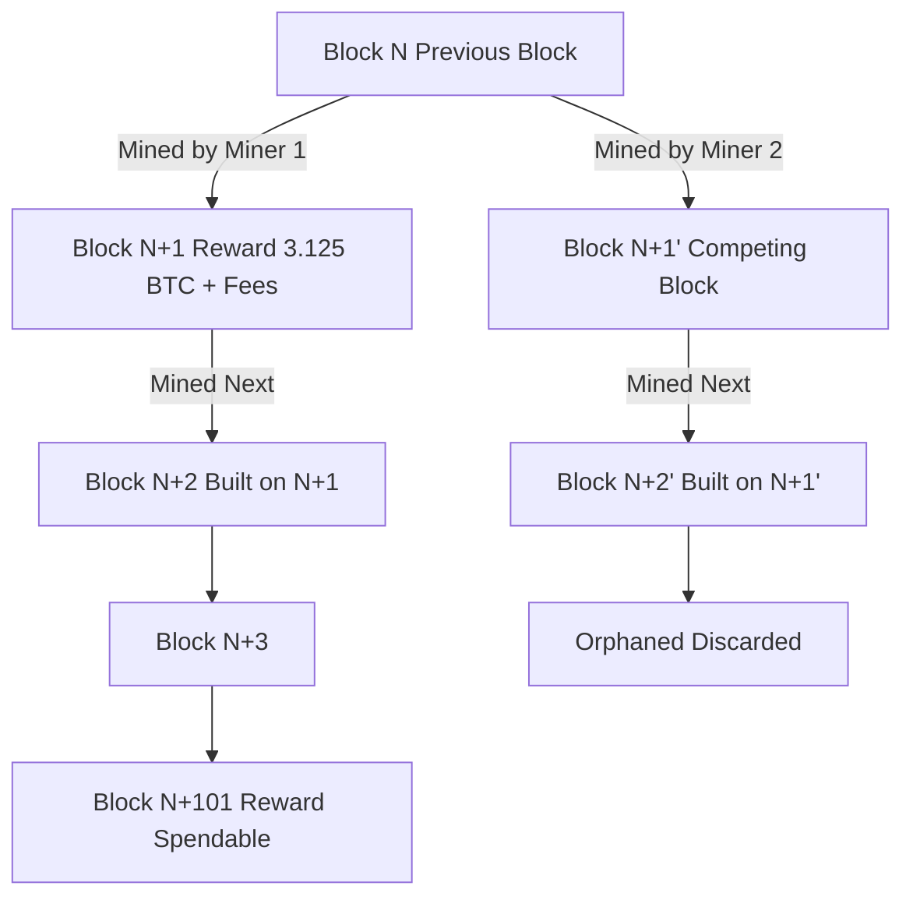

```mermaid
graph TD
    A[Block N Previous Block] -->|Mined by Miner 1| B[Block N+1 Reward 3.125 BTC + Fees]
    A -->|Mined by Miner 2| C[Block N+1' Competing Block]
    B -->|Mined Next| D[Block N+2 Built on N+1]
    C -->|Mined Next| E[Block N+2' Built on N+1']
    D --> F[Block N+3]
    F --> G[Block N+101 Reward Spendable]
    E --> X[Orphaned Discarded]
```
